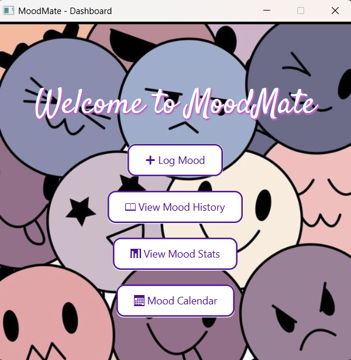
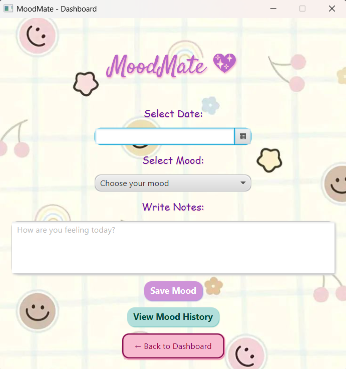
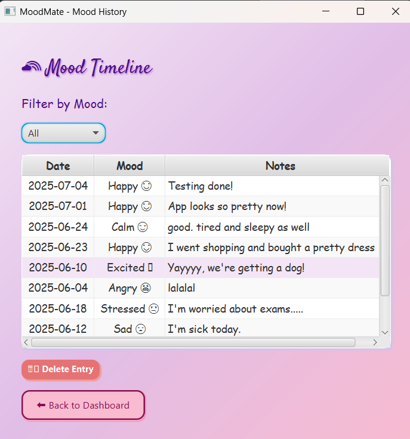
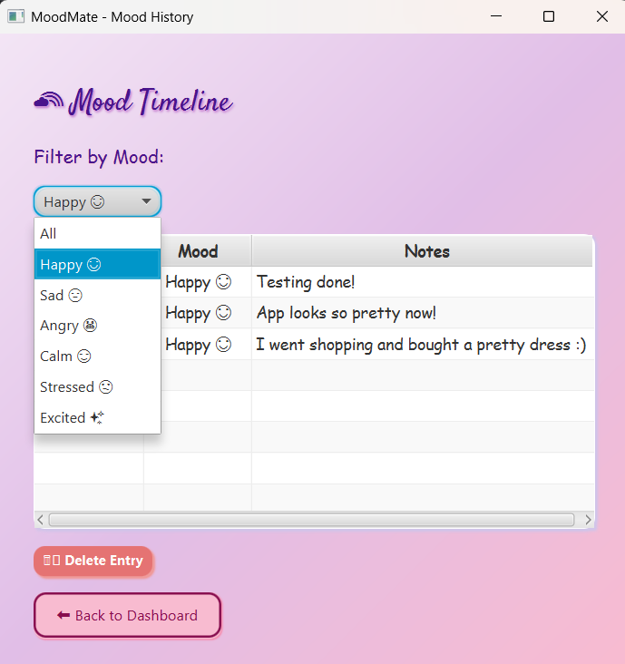
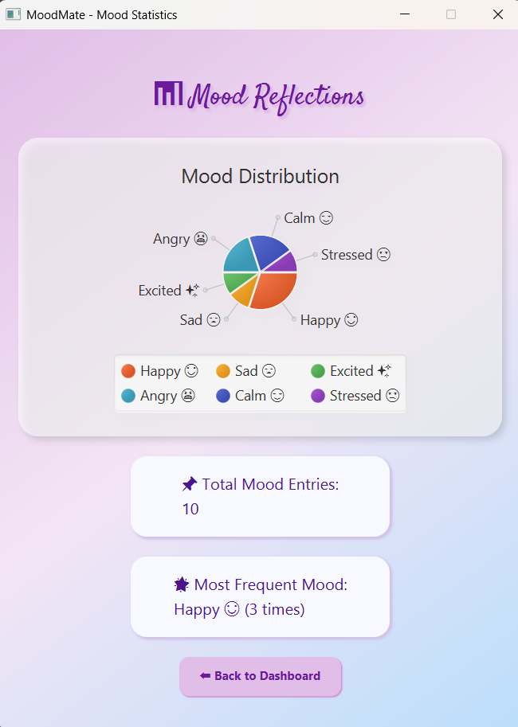
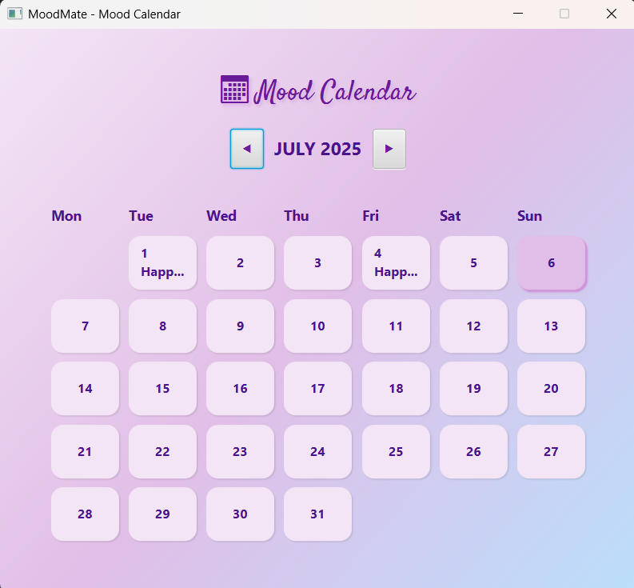

# 🌈 MoodMate - Your Daily Mood Journal

_Welcome to **MoodMate**, a minimalist and aesthetic JavaFX desktop app to *track your moods*, *express your thoughts*, and reflect through a beautiful Calendar view._

---

## 🖼️ Sneak Peek

#### 🏠 Dashboard


#### Mood Log Page


### 📝 Mood History




#### Mood Statistics



### 🗓️ Mood Calendar



*MoodMate's calming UI and thoughtful features offer a peaceful way to monitor your mental well-being.*

---

## ✨ Features

- Add and view your **daily mood** with emojis and notes
- Dashboard with total entries & most frequent mood stats
- Interactive calendar view to revisit past moods
- Review Notes for any past date
- Smooth JavaFX design with soft pastel UI
- Local database storage using SQLite
- Simple, aesthetic and beginner-friendly

---

## 🛠️ Built With

- Java 17
- JavaFX (UI Framework)
- SQLite (Database)
- IntelliJ IDEA

---
## 🚀 How to Run

1. Clone the repo:
   ```bash
   git clone https://github.com/vanshika-sharma-10/MoodMate.git
   
2. Open it in IntelliJ IDEA


3. Run Main.java


4. Explore the Dashboard 

_Use the main dashboard to:_

- Log your mood with date, emoji, and optional notes.
- View your entries in a tabular format.
- Track most frequent mood and mood count.


5. Open the Mood Calendar View

   _Click the Mood Calendar button to explore a visual calendar:_
- See mood emojis on the respective days.
- Hover and click to view notes for any logged date.
- Use ◀ and ▶ to navigate months.

---

## 📂 Folder Structure

```MoodMate/
├── .idea/
├── .mvn/
├── MoodMate.iml
├── moodmate.db
├── pom.xml
├── README.md
├── src/
│   └── main/
│       ├── java/
│       │   └── app/
│       │       ├── Main.java
│       │       └── db/
│       │           └── DatabaseHelper.java
│       └── resources/
│           └── assets/
│               ├── fonts/
│               │   ├── Carattere-Regular.ttf
│               │   ├── PuppiesPlay-Regular.ttf
│               │   ├── Rochester-Regular.ttf
│               │   └── Satisfy-Regular.ttf
│               ├── images/
│               │    ├── log-bg.jpeg
│               │    └── smiles-bg.jpeg
│               └── screenshots/
│                    ├── calendar.png
│                    ├── dashboard.png
│                    ├── filter-history.png
│                    ├── mood-cal.png
│                    ├── mood-history.png
│                    ├── mood-log.png
│                    └── stats.png
├── target/ 
```

---

## 🎨 UI Aesthetic Inspiration

The theme focuses on soft purple gradients, gentle shadows, and cozy mood logging. There are hover effects, emoji buttons and calendar interaction to make it feel interactive and personal.

---

💖 _Thank you for checking out MoodMate! Your mood matters._

---

## 💌 Author

**Vanshika Sharma**  
BCA Student | Aspiring Software Developer 

📫 [LinkedIn](https://www.linkedin.com/in/vanshika-sharma-827a92288/)  
🐱‍💻 [GitHub](https://github.com/vanshika-sharma-10)